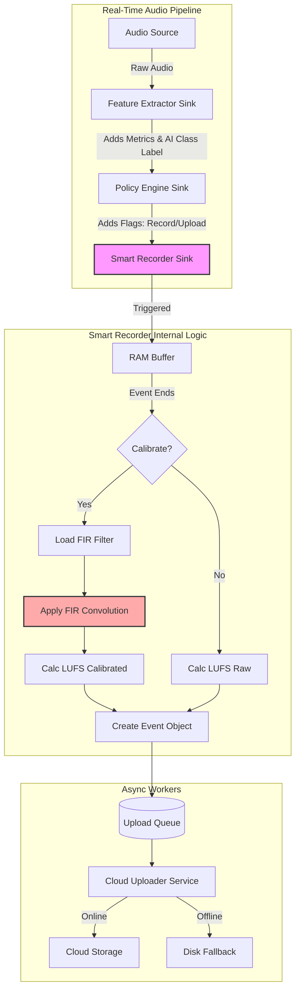
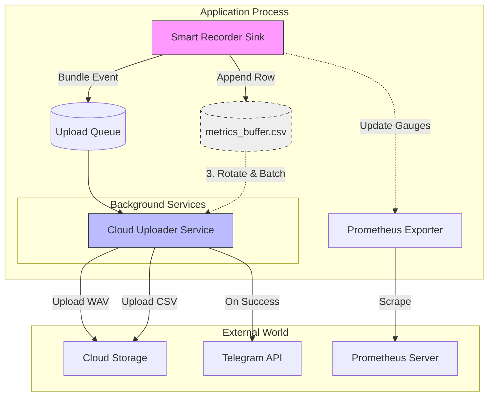
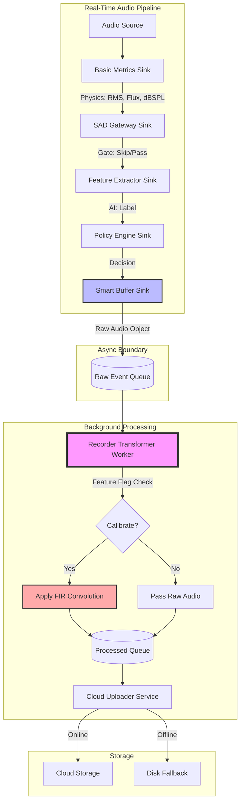
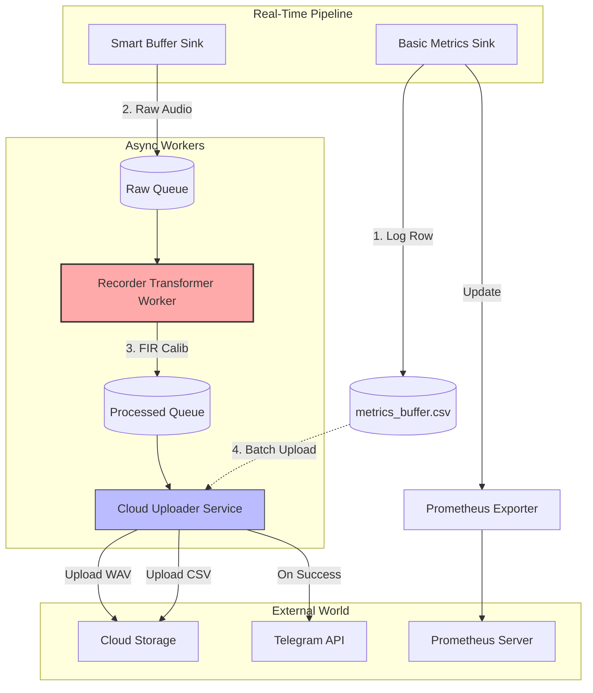

Current:

Future Plan:

Here is the updated **Future Architectural Plan** incorporating the **FIR Calibration** requirement.

This architecture solves the conflict between "Low Latency" (for detection) and "High Fidelity" (for evidence) by splitting them into two separate paths.

### The Philosophy: "Fast Trigger, Precision Record"

We apply **Scalar Calibration** (Simple Gain) in the real-time loop for speed, and **Vector Calibration** (FIR Convolution) in the background worker for audio quality.

### 1. The Real-Time Pipeline (The "Hot Path")

*Running synchronously on every audio chunk. Optimization Goal: **Latency**.*

#### **Stage 1: Basic Metrics Sink (The "Physics Engine")**

* **Calibration Type:** **Scalar Only** (Sensitivity Gain).
* **Action:**
* Apply `Gain = 10^(Sensitivity/20)` to the chunk.
* Calculate **dBSPL** and **Flux** based on this simple gain.
* *Why?* Convolution (FIR) is too heavy to run 24/7 on every single frame just for a trigger check. Simple gain is 99% accurate for loudness detection.

* **Output:** Populates `context.metrics`.

#### **Stage 2: SAD Gateway Sink**

* **Action:** Checks `context.metrics` (Scalar dBSPL) against thresholds.
* **Output:** Sets `skip_inference` flag.

#### **Stage 3: Feature Extractor Sink**

* **Action:** Runs AI model (YAMNet) if SAD passes.

#### **Stage 4: Policy Engine Sink**

* **Action:** Decides to record based on Metrics + AI.

#### **Stage 5: Smart Buffer Sink (The "Vault")**

* **Action:**
* Maintains the Ring Buffer (Pre-roll).
* When triggered, copies **Raw Audio** (Unmodified/Uncalibrated) into an Event Buffer.
* *Crucial:* We capture the *Raw* signal so we can decide how to process it later (or re-process it if calibration changes).

* **Handoff:** Pushes a `RawEventObject` (Audio + Metadata) to the **Processing Queue**.

### 2. The Async Worker (The "Cold Path")

*Running in background threads. Optimization Goal: **Quality**.*

#### **Stage 6: Recorder Transformer (The "Studio Engineer")**

* **This is the new home for the FIR logic.**
* **Input:** `RawEventObject` from the Queue.
* **Logic:**
1. **Check Config:** Is `save_calibrated_wave: true`?
2. **If YES (The Heavy Lift):**
* **Load FIR:** Load the `*_fir_*.npy` filter from disk (cached in RAM).
* **Apply Gain:** Multiply raw audio by Sensitivity Factor.
* **Apply EQ:** Run `scipy.signal.fftconvolve(audio, fir_filter)` to flatten the frequency response.
* **Recalculate Metrics:** Calculate the **Integrated LUFS** on this *new, polished* signal.

3. **If NO:**
* Use the raw audio.
* Calculate LUFS on raw audio.

* **Output:** Creates a `ProcessedEventObject`.

#### **Stage 7: Cloud Uploader Service (The "Courier")**

* **Action:**
* **Online:** Streams the `ProcessedEventObject` (WAV bytes) to S3/Magalu.
* **Offline:** Spills to Disk (DLQ).

