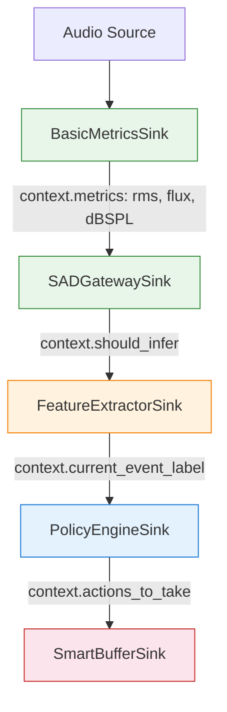
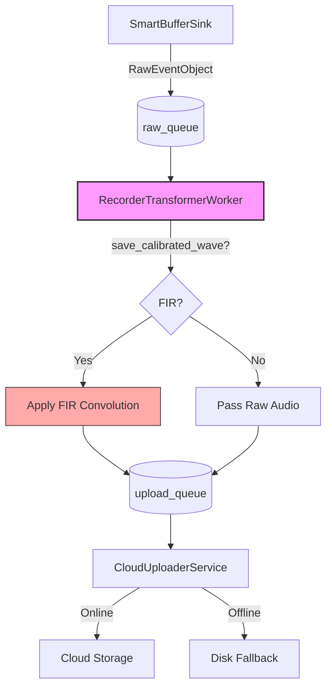
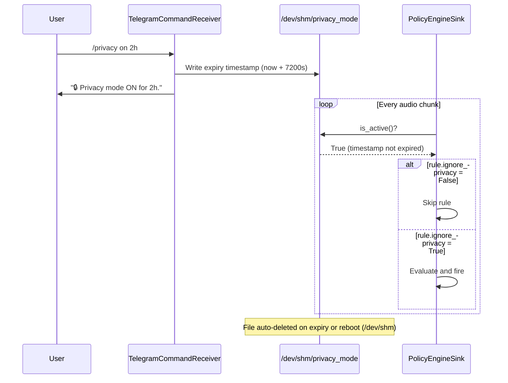
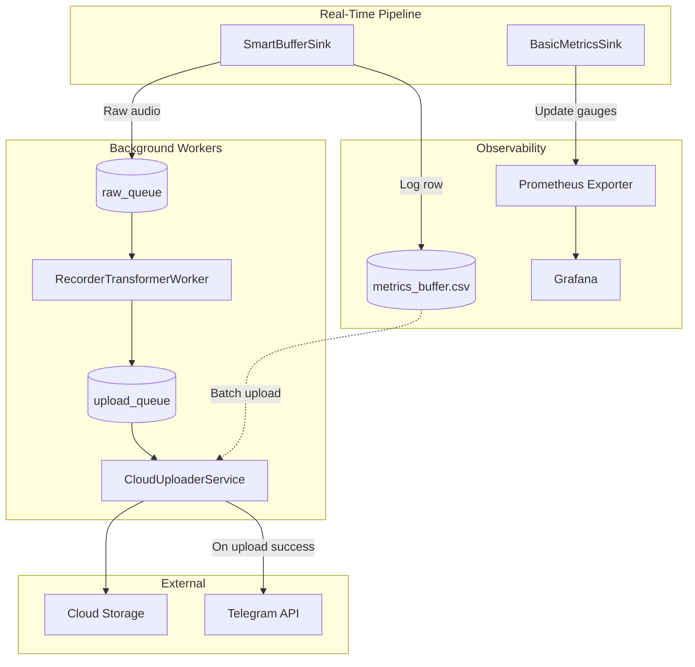

# Architecture

## Overview

The system separates real-time latency-sensitive work (the "hot path") from heavy background processing (the "cold path").

- **Hot path** — runs synchronously on every ~100 ms audio chunk. Must stay fast. No FIR convolution.
- **Cold path** — background threads. Handles FIR calibration, cloud upload, and Telegram I/O.

## Hot Path: Real-Time Audio Pipeline

Five sinks execute in order on every chunk. Each sink reads/writes the shared `PipelineContext`.

| Sink | Responsibility |
|---|---|
| **BasicMetricsSink** | Computes RMS, Flux, dBSPL on every chunk. Maintains pre-roll buffer. Updates Prometheus. |
| **SADGatewaySink** | Two-stage noise gate: Stage 1 (RMS/Flux), Stage 2 (dBSPL if mic is calibrated). Sets `should_infer`. |
| **FeatureExtractorSink** | Runs YAMNet (TFLite or full TF) when `should_infer=True`. Buffers chunks until ~0.975 s is collected. |
| **PolicyEngineSink** | Evaluates YAML policy rules against context metrics. Respects privacy mode (`ignore_privacy` flag). |
| **SmartBufferSink** | State-machine recorder. On trigger: copies pre-roll + live audio into a buffer, pushes `RawEventObject` to `raw_queue` when post-roll expires or max duration is hit. |

## Cold Path: Background Workers

| Worker | Responsibility |
|---|---|
| **RecorderTransformerWorker** | Reads from `raw_queue`. If `save_calibrated_wave=true`, applies FIR filter via `CalibratorTransformer`. On failure, forwards raw audio unchanged (evidence never dropped). |
| **CloudUploaderService** | Reads from `upload_queue`. Uploads WAV + CSV to S3/Magalu/GCP. Falls back to disk on network error. |
| **HealthMonitorService** | GPIO heartbeat pin + healthchecks.io ping on a timer. |
| **SystemHeartbeatService** | Logs system metrics (CPU, RAM, temp, disk) to CSV. |
| **TelegramCommandReceiver** | Long-polls Telegram for `/privacy` commands. Replies via `TelegramBotClient`. |

## Privacy Mode Flow

## Data Flow Summary

## Run Modes

The app supports three run modes (passed via `--run-mode`):

| Mode | Description |
|---|---|
| `monolithic` | All sinks and workers in one process. Default for single-Pi deployment. |
| `producer` | Only captures audio and pushes via ZMQ. Low-latency, minimal CPU. |
| `consumer` | Only pulls from ZMQ, runs inference and upload workers. |

The producer/consumer split is useful on dual-process Raspberry Pi deployments where the audio capture process has elevated scheduling priority.
