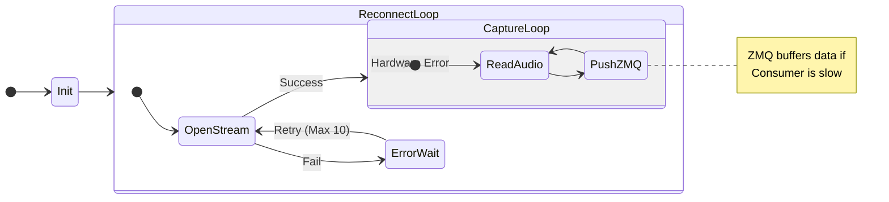
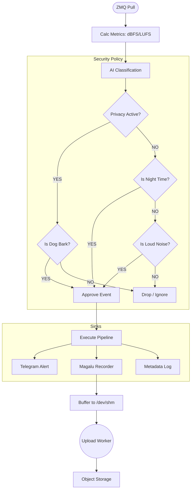
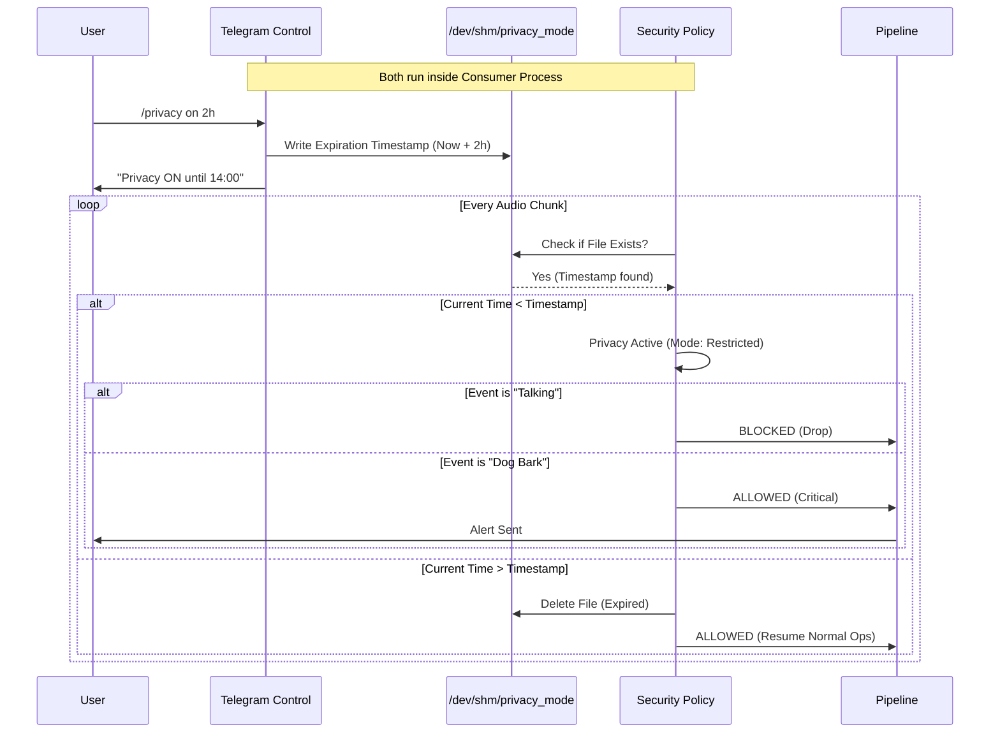

https://www.drsilencio.com.br/como-provar-que-o-vizinho-faz-barulho/
https://www.ambietica.com.br/Noticias/358/Laudo-e-Monitoramento-de-Ruidos
https://roomonitor.com/en/prices/
https://www.minut.com/pricing


1. Setting up Multiple Wi-Fi Networks

$ sudo nano /etc/wpa_supplicant/wpa_supplicant.conf

    ctrl_interface=DIR=/var/run/wpa_supplicant GROUP=netdev
    update_config=1
    country=BR  <-- Ensure this matches your location (Brazil)

    # Primary Network (Home) - Priority 10
    network={
        ssid="My_Home_WiFi"
        psk="home_password"
        priority=10
    }

    # Backup Network (Hotspot) - Priority 5
    network={
        ssid="My_Phone_Hotspot"
        psk="hotspot_password"
        priority=5
    }


Ideia:
- monitorar som para identificar ruídos ou barulhos
- principal: latidos, vozes e outros sons indesejados
- otimizar utilizando ML, salvando chunks de audio
- agregar audios e enviar para nuvem
- envio de métricas em modo push para servidor
- criação de relatório de eventos geral e detalhado
- - geral: estatísticas vindas do painel do grafana, dias, frequência, origem, intensidade
- - detalhado: listagem completa de arquivos de gravações por dia para ser disponbilizada em modo texto com referência a links HTML (criar sistema de navegação HTML simples)
- possibilidade: fotografia com timestamp

Extra:
- servidor com prometheus e storage de dados
- bucket para armazenamento por cliente
- piloto para validar processo 


Clientes potenciais:
- engenheiros de laudos
- advogados
- síndicos
- imobiliárias
- inquilos

Necessito:
- Raspberry Pi: qual versão aguenta? precisa de GPU?
- Caixa para Raspberry e Microfone
- Memória para Raspberry
- Conexão com internet?
- Health check alarm?
https://healthchecks.io/


import requests
import time

# ... your main app logic ...

while True:
    try:
        # Do your work
        run_my_process()

        # Send Heartbeat
        requests.get("https://hc-ping.com/your-uuid-here")

    except Exception as e:
        print(f"Error: {e}")

    time.sleep(60)

```mermaid
graph LR
    subgraph Edge_Device [Raspberry Pi 4B]
        direction TB
        
        subgraph Hardware
            Mic[Microphone]
            RAM_Disk[("/dev/shm (RAM)")]
        end

        subgraph Process_A [Producer Service (High Priority)]
            Listener[Audio Listener]
            ZMQ_Push[ZMQ PUSH Socket]
        end

        subgraph Process_B [Consumer Service (Analysis)]
            ZMQ_Pull[ZMQ PULL Socket]
            Brain[Analysis & Policy Engine]
            TeleBot[Telegram Bot Thread]
        end
    end

    subgraph External
        User((User))
        TelegramAPI[Telegram API]
        MagaluCloud[Magalu Object Storage]
    end

    %% Connections
    Mic -->|Raw Audio| Listener
    Listener -->|Chunk + Timestamp| ZMQ_Push
    ZMQ_Push -.->|TCP:5555| ZMQ_Pull
    ZMQ_Pull --> Brain
    
    Brain -->|Alerts| TelegramAPI
    Brain -->|WAV Files| MagaluCloud
    Brain -->|Metadata CSV| MagaluCloud
    
    User -->|Commands /privacy| TeleBot
    TeleBot -->|Write Flag| RAM_Disk
    Brain -->|Read Flag| RAM_Disk
    TeleBot -->|Replies| TelegramAPI
```









# 1. Install the package
uv sync --extra dev

# 2. Download Models
uv run edge-setup-models

# 3. Run the Service Installer (Must use sudo)
# Note: We use 'sudo -E' to preserve the 'uv' environment variables if needed,
# or point directly to the python in .venv
sudo .venv/bin/python -m src.scripts.install_service \
  --config ./security_policy.yaml \
  --env ./.env \
  --calib ./7001234.txt